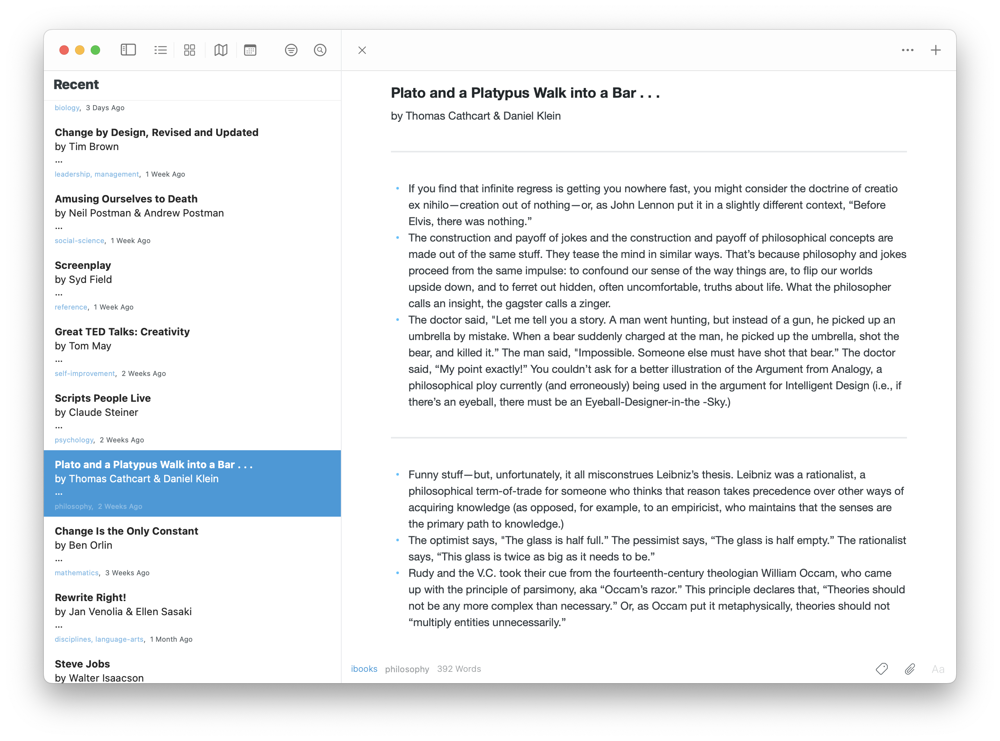

# queryibooks

- **queryibooks**: Get annotations from iBooks
- **ibooks2dayone**: Create DayOne import for iBook annotations

## Usage

```console
$ queryibooks

[
    {
    "Z_PK": 2212,
    "ZANNOTATIONCREATIONDATE": "2023-06-07T21:25:46Z",
    "ZANNOTATIONASSETID": "1451477922",
    "ZFUTUREPROOFING5": null,
    "ZANNOTATIONNOTE": null,
    "ZANNOTATIONSTYLE": 3,
    "ZANNOTATIONTYPE": 2,
    "ZANNOTATIONISUNDERLINE": 0,
    "ZPLLOCATIONRANGESTART": 49,
    "ZANNOTATIONLOCATION": "epubcfi(/6/100[chapter019]!/4/2/2[chapter019]/28/1,:0,:98)",
    "ZANNOTATIONSELECTEDTEXT": "For mathematicians, “inverse processes” are actions that undo each other, counteracting opposites.",
    "ZANNOTATIONREPRESENTATIVETEXT": "For mathematicians, “inverse processes” are actions that undo each other, counteracting opposites. ",
    "ZASSETID": "1451477922",
    "ZTITLE": "Change Is the Only Constant",
    "ZAUTHOR": "Ben Orlin",
    "ZGENRE": "Mathematics",
    "ZSTOREID": "1451477922",
    "ZSORTAUTHOR": "Orlin, Ben",
    "ZSORTTITLE": "Change Is the Only Constant",
    "ZASSETGUID": "06DFEBE0-EE4D-4D19-B577-D84F166AE7CA"
  },
  ...
]
```

### DayOne

<center></center>

```console
$ queryibooks | ibooks2dayone
Reading assets from /Users/annie/.cache/queryibooks/2023-08-02-12/assets.json
Reading annotations from /Users/annie/.cache/queryibooks/2023-08-02-12/annotations.json

Done!
Import /Users/annie/Downloads/ibooks-dayone-2023-08-02-12-45.zip to Day One
```


